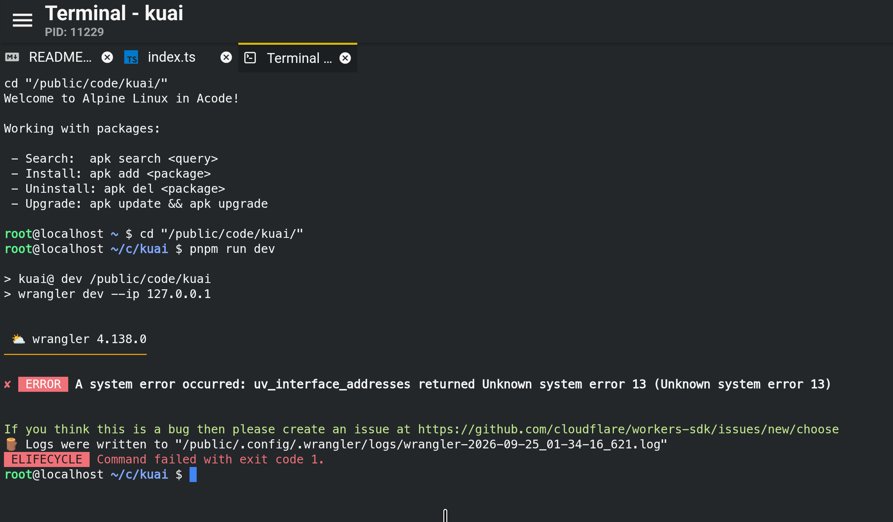

## wrangler 4.138.0: uv_interface_addresses error‑13 on Android Termux (LXC container), dev.ip config cannot skip interface enumeration

---

### Describe the bug

Running `wrangler dev` inside Android Termux \(LXC container\) crashes immediately:

```Plain Text
✘ [ERROR] A system error occurred: uv_interface_addresses returned Unknown system error 13 (Unknown system error 13)
```

Error 13 means `EACCES`, the container process has no permission to list network interfaces\.

**Bug logic issue**:
Even though I have set listening ip in `wrangler.toml`:

```toml
[dev]
ip = "127.0.0.1"
```

Wrangler calls `uv_interface_addresses` **before parsing the configuration file**\.
It tries to scan all network adapters at startup and crashes before it reads the fixed‑ip setting, the toml config becomes useless\.

The only working workaround right now is to pass ip via cli argument:
`wrangler dev --ip 127.0.0.1`

### To Reproduce

1. Android device with Termux\(LXC\)

2. Install node and wrangler@4\.138\.0

3. Configure `[dev].ip = "127.0.0.1"` in wrangler\.toml

4. Run `wrangler dev` without `--ip` flag

5. Crash with uv permission error

### Expected behavior

If user explicitly provides `dev.ip` \(config file or cli flag\), **skip the network‑interface enumeration entirely**\.
Only scan available interfaces when no bind‑ip is specified\.

### Environment

- OS: Android Termux \(LXC container\)

- wrangler: 4\.138\.0

### Workaround

```bash
wrangler dev --ip 127.0.0.1
```

Older wrangler `4.79.0` works fine without early‑stage network scan\.

